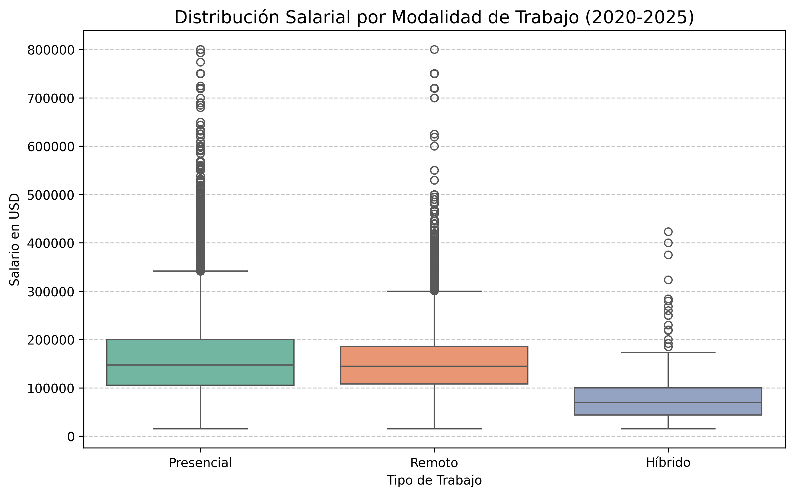

# 📊 Análisis de Salarios en Data Science & IA (2020-2025)

## 📝 Descripción del Proyecto
Este proyecto realiza un **Análisis Exploratorio de Datos (EDA)** sobre las tendencias salariales globales en el sector de la tecnología. El objetivo es identificar cómo han evolucionado los sueldos tras la explosión de la Inteligencia Artificial y si la modalidad remota sigue siendo competitiva en 2026.

Este es mi primer proyecto profesional de Data Science, donde aplico técnicas de limpieza, transformación y visualización de datos.

## 🛠️ Tecnologías Utilizadas
* **Lenguaje:** Python 3.x
* **Librerías:** * `Pandas`: Manipulación y limpieza de datos.
    * `Seaborn` & `Matplotlib`: Visualización de datos profesional.
* **Entorno:** Google Colab

## 📈 Hallazgos Principales (Insights)

### 1. Evolución por Roles
Al analizar el "Top 5" de puestos más demandados, observamos que:
* El **Data Engineer** y el **Machine Learning Engineer** muestran una tendencia de crecimiento más sólida.
* Los salarios en 2025 reflejan una estabilización tras los picos de contratación del periodo 2021-2022.

### 2. El Mito del Trabajo Remoto
Mediante un análisis de distribución (Boxplots), determinamos que:
* No existe una penalización salarial significativa por trabajar de forma **100% remota**.
* Las empresas de nivel mundial (Global) están igualando sueldos remotos con los presenciales para atraer talento especializado.

## 📂 Estructura del Repositorio
* `salaries.csv`: Base de datos original con registros actualizados a 2025.
* `Analisis_Salarios_Data_IA.ipynb`: Cuaderno de Python con todo el código ejecutado.
* `README.md`: Explicación del proyecto.

## 🚀 Cómo ejecutar este proyecto
1. Clona este repositorio.
2. Sube el archivo `.ipynb` a [Google Colab](https://colab.research.google.com/).
3. Carga el archivo `salaries.csv` cuando el código lo solicite.
4. Ejecuta todas las celdas para ver las gráficas en tiempo real.

---
⭐ **Habilidades demostradas:** Storytelling con datos, programación en Python, análisis estadístico básico.

### 📈 Hallazgos Visuales

#### Evolución Salarial 2020-2025

#### Comparativa de Modalidad de Trabajo

